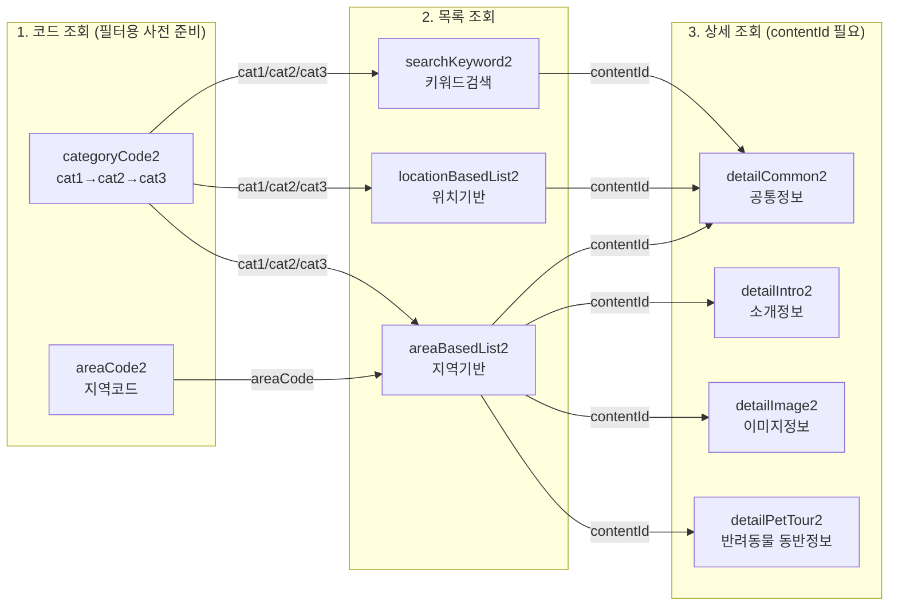

## 오퍼레이션 설명

| 단계 | API | 역할 |
|---|---|---|
| 1. 코드 조회 | `areaCode2` | 지역 필터용 코드 조회 |
| 1. 코드 조회 | `categoryCode2` | 카테고리 필터용 코드 조회 (cat1→cat2→cat3 계층 조회) |
| 2. 목록 조회 | `areaBasedList2` | 지역 기준 목록 조회 |
| 2. 목록 조회 | `locationBasedList2` | 좌표(위경도) 기준 목록 조회 |
| 2. 목록 조회 | `searchKeyword2` | 키워드 기반 검색 |
| 3. 상세 조회 | `detailCommon2` | 이름/주소/개요/위치 |
| 3. 상세 조회 | `detailIntro2` | 운영시간/휴무일/요금 |
| 3. 상세 조회 | `detailImage2` | 이미지 리스트 |
| 3. 상세 조회 | `detailPetTour2` | 반려동물 동반 가능 정보 (핵심 기능) |

## 주의사항
- `categoryCode2`, `areaCode2`는 목록 조회 API에 넘길 **필터 파라미터를 알아내기 위한 사전 조회**이지, 실제 서비스 화면에서 매번 호출하는 게 아님 (한 번 조회해서 코드표로 저장해두고 재사용)
- `detailPetTour2`는 반드시 목록 조회로 얻은 `contentId`가 있어야 호출 가능
